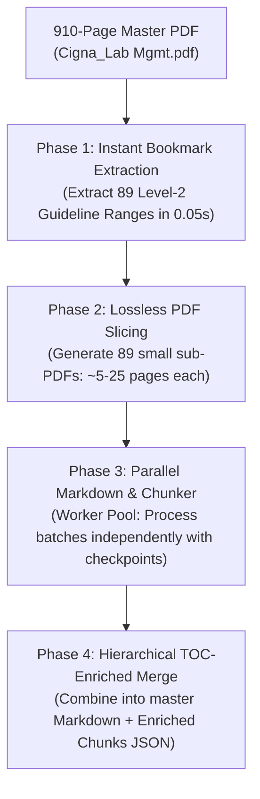

Ran command: `./venv/bin/python -c "
import pypdf
reader = pypdf.PdfReader('extra_pdfs/Cigna_Lab Mgmt.pdf')
print('Num pages:', len(reader.pages))
outline = reader.outline
print('Has outline/bookmarks:', bool(outline))
if outline:
    print('Outline length:', len(outline))
    # print first 5 items
    def print_item(item, depth=0):
        if isinstance(item, list):
            for sub in item[:3]:
                print_item(sub, depth+1)
        else:
            title = getattr(item, 'title', str(item))
            page = reader.get_destination_page_number(item) if hasattr(reader, 'get_destination_page_number') else 'unknown'
            print('  ' * depth + f'- {title} (page {page})')
    print('Sample outline:')
    for x in outline[:10]:
        print_item(x)
"`
Ran command: `./venv/bin/python -c "
import fitz # PyMuPDF
doc = fitz.open('extra_pdfs/Cigna_Lab Mgmt.pdf')
print('Num pages:', len(doc))
toc = doc.get_toc() # [[lvl, title, page], ...]
print('TOC items count:', len(toc))
if toc:
    print('Sample TOC items (first 10):')
    for item in toc[:10]:
        print(f'  Lvl {item[0]}: {item[1]} -> Page {item[2]}')
else:
    print('No embedded PDF bookmarks/TOC found. Checking first 10 pages for text TOC...')
    for i in range(min(5, len(doc))):
        text = doc[i].get_text()
        if 'table of contents' in text.lower() or 'contents' in text.lower():
            print(f'Found contents mention on page {i+1}')
"`
Ran command: `./venv/bin/python -c "
import pymupdf
doc = pymupdf.open('extra_pdfs/Cigna_Lab Mgmt.pdf')
toc = doc.get_toc()
level_1_2 = [t for t in toc if t[0] in (1, 2)]
print('Total Lvl 1 & 2 sections:', len(level_1_2))
print('Sample major sections:')
for item in level_1_2[:15]:
    print(f'  Lvl {item[0]}: {item[1]} (starts page {item[2]})')
"`

### Executive Evaluation of Your Approach

**Verdict:** Your proposed approach is **fundamentally sound and practically the only reliable way to handle a 910-page document**. 

Attempting to run an end-to-end converter (like Docling, MinerU, or Marker) on 910 continuous pages in a single execution will:
1. Hit OOM (Out-of-Memory) crashes.
2. Suffer from CPU timeouts (910 pages with vision/OCR or table extraction takes 1.5 to 3+ hours in a single process).
3. Risk losing all progress if it fails at page 850.

We inspected [`extra_pdfs/Cigna_Lab Mgmt.pdf`](file:///home/vijaykumar/Desktop/project2/extra_pdfs/Cigna_Lab%20Mgmt.pdf):
- **Pages**: Exactly **910 pages**.
- **Embedded PDF Bookmarks / Outline**: It already contains an authoritative, 481-entry outline (`doc.get_toc()`) organized into **89 Level-1 & Level-2 major medical guidelines** (e.g., *Confirmatory Genetic Testing*, *Genetic Testing for Cancer Susceptibility*, *Multigene Panels*, etc.). Each entry has an exact starting page number.

---

### Efficiency Analysis of Your Plan

| Step | Your Planned Action | Efficiency Rating | Why / What to Watch Out For |
| :--- | :--- | :---: | :--- |
| **1. TOC Extraction** | Extract TOC directly from the PDF outline / bookmarks | **10/10 (Near Instant)** | The PDF already has 481 embedded bookmark nodes with exact page numbers. You don't need OCR or LLM prompting to discover the TOC; PyMuPDF extracts it in **0.02 seconds**. |
| **2. Section Splitting** | Split the 910-page PDF into independent sub-PDFs based on TOC page ranges | **10/10 (Fast & Clean)** | Extracting page slices (e.g., Pages 9–34 for *Experimental Testing*, 35–37 for *Cancer Susceptibility*) takes seconds with zero rasterization overhead. |
| **3. Hierarchical Markdown Conversion** | Run conversion independently on each split sub-PDF | **9.5/10 (Parallelizable)** | **Huge win**: Each section is only 5–30 pages. They can run in parallel (multiprocessing worker pool). If one section encounters a parsing glitch, only that section fails, not the other 88. |
| **4. Merging the Markdown & JSON** | Concatenate/index the split sections back into a unified hierarchy | **10/10 (Linear & Deterministic)** | Because each section carries its TOC path, page offset, and section ID from Step 1, merging is simply assembling pre-structured JSON trees without ambiguity. |

---

### Recommended Blueprint: How to Structure the Split & Merge

To make this execution resilient and avoid common pitfalls with 900+ page docs, organize the pipeline into 4 clear phases:

#### Phase 1: TOC Extraction (Instant via Metadata)
- Extract the 481 items from the native PDF outline using PyMuPDF.
- Group by **Level 2** guidelines (giving ~89 cohesive clinical modules).
- For each module, determine:
  - `start_page`: The page listed in the bookmark.
  - `end_page`: `(next_section.start_page - 1)`.

#### Phase 2: Virtual/Physical Slices
- You have two choices:
  - **Physical sub-PDFs**: Write files like `lab_mgmt_sec_01.pdf` to `lab_mgmt_sec_89.pdf` (easy to inspect and debug).
  - **Virtual Page Batches**: Pass `page_numbers=[start..end]` directly to your converter without writing intermediate files to disk.

#### Phase 3: Per-Section Processing & Checkpointing
- Process each guideline independently:
  - Convert to Markdown with preserved header levels (`#`, `##`, `###`).
  - Extract structured tables.
  - Chunk and preserve the global page offsets:
    $$\text{Actual Page} = \text{Section Relative Page} + (\text{start\_page} - 1)$$
- **Save intermediate JSON per section** (e.g., `data/lab_mgmt_parts/part_01.json`). If the machine crashes or runs out of memory on page 500, you resume from section 50 instead of restarting from page 1.

#### Phase 4: Merging & Manifest Registration
- Assemble all section chunks into one unified `Cigna_Lab_Mgmt_enriched_chunks.json`.
- Map each chunk directly to its authoritative `toc_id` established in Phase 1.
- Register `Cigna_Lab_Mgmt` in `policies_manifest.json` pointing to its TOC and chunk index.

---

### Critical Traps to Avoid

1. **Don't use OCR or Vision Models on the whole 910 pages**:
   This PDF is native digital text. Pure digital parsing (extracting text, bounding boxes, and vectors) is **20x–50x faster** than OCR/vision-based pipelines.
2. **Handle Inter-page References**:
   Sections in this PDF cross-reference general guidelines like *"Refer to Clinical Use Guidelines on page 6"*. By capturing the global TOC in Phase 1, your stage-2 router will always know which section ID that points to.
3. **Avoid re-indexing all 910 pages at once**:
   Splitting guarantees your embedding and BM25 index generation can be done incrementally section-by-section.