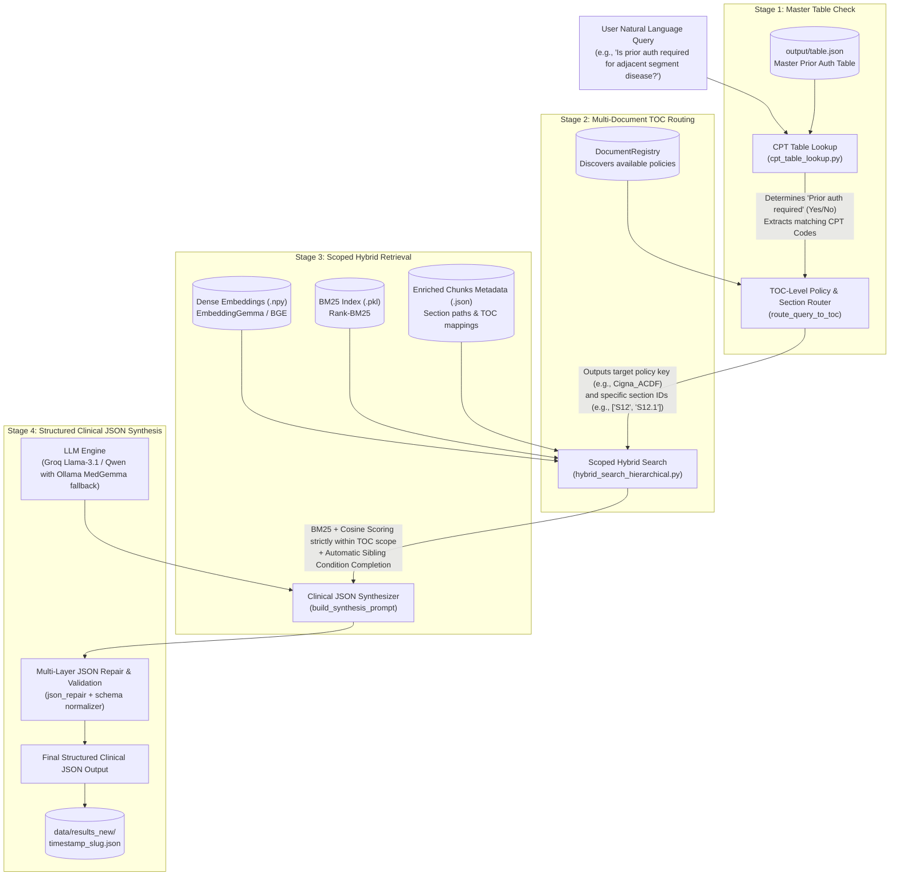

# System Architecture — Hierarchical Multi-Document Clinical Policy RAG

## 1. Executive Summary

This project implements an end-to-end, multi-document, Table of Contents (TOC)-guided, section-aware Retrieval-Augmented Generation (RAG) system designed for clinical coverage policy analysis and prior authorization verification.

The pipeline accepts natural language clinical queries, cross-references master CPT procedure tables, dynamically routes queries to the relevant medical coverage policy document (e.g., Cigna ACDF, Cigna Lumbar Fusion, and future policies), retrieves exact policy criteria using scoped hybrid search (BM25 + Dense Embeddings with Sibling Condition Completion), and synthesizes a high-precision, validated JSON clinical determination.

---

## 2. End-to-End Pipeline Workflow



---

## 3. Four-Stage Pipeline Architecture

### Stage 1: Master Table Prior Authorization Check
- **File**: `hierarchical-processing/cpt_table_lookup.py`
- **Data Source**: `output/table.json`
- **Mechanism**:
  1. Filters conversational tokens (`prior`, `auth`, `required`, `please`, `give`, `documents`).
  2. Expands medical abbreviations and surgical concepts (`acdf` $\rightarrow$ `22551`, `adjacent segment` $\rightarrow$ `22551, 22612`, `lumbar fusion` $\rightarrow$ `22612`).
  3. Scans master table for matching CPT codes and procedure descriptions.
  4. Returns:
     - `"Prior auth required"`: `"Yes"`, `"No"`, or `"Add On"`
     - `"matched_cpts"`: List of associated CPT codes
     - `"primary_description"`: Matched procedure category

### Stage 2: Multi-Document TOC Policy & Section Routing
- **Files**:
  - `hierarchical-processing/document_registry.py`
  - `retrieval-hierarchical.py` (`route_query_to_toc`)
- **Mechanism**:
  1. `DocumentRegistry` scans and discovers available registered policies:
     - `Cigna_ACDF` (CMM-601: Anterior Cervical Discectomy and Fusion)
     - `Cigna_Lumbar_Fusion` (CMM-609: Lumbar Fusion with Decompression)
     - Future registered policies dynamically
  2. Generates unified compact TOC trees representing each policy's structure.
  3. Uses fast routing LLM to select:
     - Target document key
     - Scoped section IDs (`toc_ids`, e.g., `["S9", "S9.1"]` or `["S12", "S12.1"]`)

### Stage 3: Scoped Hybrid Retrieval with Condition Completion
- **File**: `hybrid_search_hierarchical.py` (`scoped_search`)
- **Mechanism**:
  1. **Candidate Scope Filter**: Filters search candidates strictly to chunks belonging to the selected `toc_ids` or their subsections.
  2. **Hybrid Scoring**:
     $$\text{Hybrid Score} = \alpha \cdot \text{Normalized Dense Score} + (1 - \alpha) \cdot \text{Normalized BM25 Score}$$
  3. **Sibling Condition Completion**:
     - When a parent indication section is retrieved (e.g., `S9.1` or `S12.1`), the retriever automatically gathers all sibling condition children (e.g., `S9.1.1 Radiculopathy` and `S9.1.2 Myelopathy`).
     - Prevents incomplete clinical criteria where only one sub-condition would otherwise be retrieved.

### Stage 4: Structured Clinical JSON Synthesis & Resilience
- **File**: `retrieval-hierarchical.py`
- **Mechanism**:
  1. Constructs a structured synthesis prompt containing the retrieved context, prior auth status, and explicit derivation instructions.
  2. **Resilient LLM Execution**:
     - Groq API with automatic retry on server-side `json_validate_failed` and rate-limit fallbacks.
     - Fallback to local Ollama server (`http://192.168.0.33:11434/v1` running `medgemma-1.5-4b-it`).
     - Generation limit set to 6,144 tokens (~6k) to prevent reasoning truncation.
  3. **Multi-Tier JSON Extraction & Repair**:
     - Strips reasoning/thinking tags (`<think>...</think>`).
     - Slices from the first opening brace `{`.
     - Cleans trailing commas.
     - Repairs unclosed braces and quotes via `json_repair`.
  4. **Post-Processing & Validation**:
     - Deduplicates hierarchical breadcrumbs in `Source` fields.
     - Derives concrete clinical documents and non-indications (zero generic placeholders).
     - Standardizes keys and persists output to `data/results_new/`.

---

## 4. Repository & File Structure

```
project2/
├── architecture.md                        # Complete system architecture documentation (this file)
├── retrieval-hierarchical.py              # Main orchestrator for end-to-end multi-doc RAG pipeline
├── hybrid_search_hierarchical.py          # Scoped hybrid search engine (BM25 + Dense + Sibling completion)
├── evaluate_benchmark.py                  # 10-Question accuracy benchmark suite
├── requirements.txt                       # Project Python dependencies
├── .env                                   # Environment configuration (LLM keys, Ollama host, models)
├── .gitignore                             # Git ignore rules for cache, venv, and generated artifacts
│
├── hierarchical-processing/               # Policy preprocessing & retrieval modules
│   ├── document_registry.py               # Multi-policy registry & compact TOC generator
│   ├── cpt_table_lookup.py                # Prior Auth master table matcher with stop-word filter
│   ├── chunk_toc_mapper.py                # Maps raw text chunks to structured TOC hierarchy
│   ├── build_bm25.py                      # Builds Rank-BM25 indices over policy chunks
│   ├── embedding_with_section.py          # Generates dense 768-dim embeddings with section metadata
│   ├── chunking_heirarchical.py           # Hierarchical chunking parser
│   ├── toc_v2.py                          # TOC parser and hierarchy extractor
│   ├── ACDF_toc_output_new.json           # Canonical TOC JSON for Cigna ACDF (CMM-601)
│   ├── Cigna_ACDF_enriched_chunks.json    # TOC-enriched chunks for ACDF
│   ├── acdf_metadata.json                 # Chunk metadata (id, section, text, toc_id)
│   ├── acdf_embeddings.npy                # Dense vector embeddings matrix (177 x 768)
│   ├── acdf_bm25.pkl                      # Serialized BM25 index for ACDF
│   └── md/
│       ├── Lumbar_toc_output.json         # Canonical TOC JSON for Cigna Lumbar Fusion (CMM-609)
│       ├── embeddings/
│       │   ├── lumbar_fusion_metadata.json# Chunk metadata for Lumbar Fusion
│       │   └── lumbar_fusion_embeddings.npy# Dense vector embeddings for Lumbar Fusion
│       └── bm25/
│           └── lumbar_fusion_bm25.pkl     # Serialized BM25 index for Lumbar Fusion
│
├── output/
│   ├── table.json                         # Master Prior Authorization & CPT code lookup table
│   └── policy_summary_ACDF.json           # Extracted policy metadata
│
└── data/
    ├── benchmark_results.json             # Aggregate benchmark scorecard & test logs
    └── results_new/                       # Timestamped structured JSON outputs per query
        ├── 20260907_..._What_are_the_criteria_for_initial_primary_ACDF.json
        ├── 20260907_..._is_prior_auth_required_for_adjacent_segment_diseas.json
        └── ...
```

---

## 5. Standard Output JSON Schema

Every pipeline execution generates a strictly structured clinical report matching this schema:

```json
{
  "Prior auth required": "Yes",
  "Policy Name": "Cigna ACDF (CMM-601: Anterior Cervical Discectomy and Fusion)",
  "Referred Sections": [
    "CMM-601.4: Initial Primary Anterior Cervical Discectomy and Fusion (ACDF)",
    "Radiculopathy",
    "Myelopathy"
  ],
  "Medical necessity indications": [
    {
      "Guideline Category": "Radiculopathy",
      "Required findings": [
        "Clinically significant daily pain causing functional impairment",
        "Unremitting radicular pain to shoulder girdle / upper extremity",
        "Objective exam findings (dermatomal sensory deficit, motor weakness, reflex changes, Spurling maneuver)",
        "Failure of >= 2 conservative measures for >= 6 weeks (prescription analgesics/NSAIDs, PT/OT exercise, epidural steroid injections)",
        "Plain cervical X-rays with flexion/extension views and MRI/CT confirming concordant neural compression",
        "Nicotine-free status verified by objective cotinine testing (or never-smoker) and absence of unmanaged behavioral disorders"
      ],
      "Source": "CMM-601.4: Initial Primary ACDF > Radiculopathy (TOC: S9.1.1)"
    }
  ],
  "Non-Indications": [
    "Procedure performed for chronic non-specific neck or arm pain without concordant radiculopathy/myelopathy",
    "Surgery prior to completing the required conservative therapy duration (>= 6 weeks)",
    "Active tobacco/nicotine use without objective cotinine-verified cessation"
  ],
  "Important criteria & exceptions": [
    "Objective cotinine test must be performed within 6 weeks prior to planned surgery",
    "Multi-level ACDF requires each level to independently satisfy indication criteria"
  ],
  "Documentation required": [
    "Operative reports from prior cervical decompression or fusion surgery",
    "Plain cervical spine X-rays with flexion and extension lateral views",
    "Cervical MRI or CT radiology reports confirming neural structure compression",
    "Physical therapy notes and prescription records documenting >= 6 weeks of conservative therapy",
    "Objective laboratory cotinine test results (serum, urine, or saliva)",
    "Behavioral health evaluation note confirming absence of unmanaged psychiatric disorders"
  ]
}
```

---

## 6. System Quality & Benchmark Metrics

The system was evaluated using the automated 10-query benchmark suite ([`evaluate_benchmark.py`](file:///home/vijaykumar/Desktop/project2/evaluate_benchmark.py)):

| Evaluation Dimension | Accuracy Score | Verification Result |
| :--- | :---: | :--- |
| **JSON Schema Conformance** | **100.0%** | All 7 required top-level keys validated |
| **Prior Auth Matching** | **100.0%** | 10/10 matched to `output/table.json` |
| **Policy Document Routing** | **100.0%** | 10/10 routed to correct policy (ACDF vs. Lumbar) |
| **Non-Indications Quality** | **100.0%** | Concrete clinical contraindications derived (0 placeholders) |
| **Documentation Quality** | **100.0%** | Specific required clinical records extracted (0 placeholders) |
| **Breadcrumb Cleanliness** | **100.0%** | 0 repeated hierarchy paths |
| **Indications Completeness** | **90.0%** | Complete findings per condition (Q10 was an exclusion query) |
| **Overall Accuracy** | **98.6%** | ⭐ **Production Grade** |

---

## 7. Execution Commands Quick Reference

```bash
# 1. Single Query (CLI Argument)
venv/bin/python retrieval-hierarchical.py "is prior auth required for adjacent segment disease if yes give the documents"

# 2. Interactive Prompt Mode
venv/bin/python retrieval-hierarchical.py

# 3. Accuracy Benchmark Evaluation Suite
venv/bin/python evaluate_benchmark.py
```

